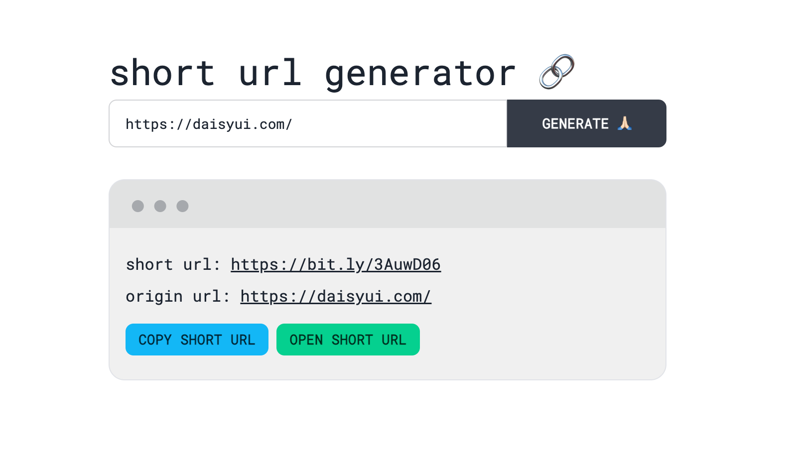

# DevProjects - Link shortener website

This is an open source project from [DevProjects](http://www.codementor.io/projects). Feedback and questions are welcome!
Find the project requirements here: [Link shortener website](https://www.codementor.io/projects/web/link-shortener-website-brqjanf6zq)

## Tech/framework used
Built with Vue, daisyUI

## Screenshots and demo
### [Preview](https://short-url-hazel.vercel.app/)



## Installation
```bash
pnpm install && pnpm run dev
```

## License
[MIT](https://choosealicense.com/licenses/mit/)
Most open source projects use the MIT license. Feel free to choose whichever license you prefer.
